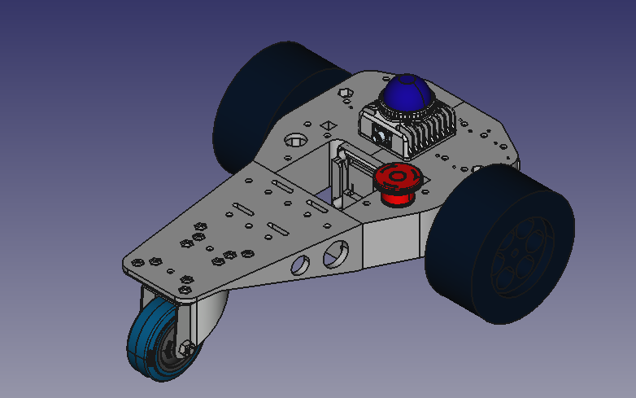
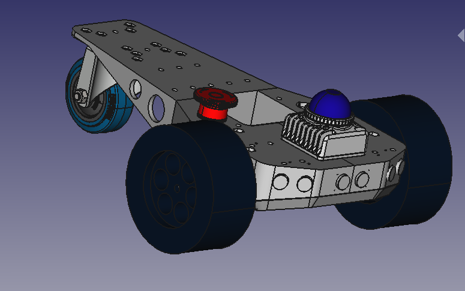
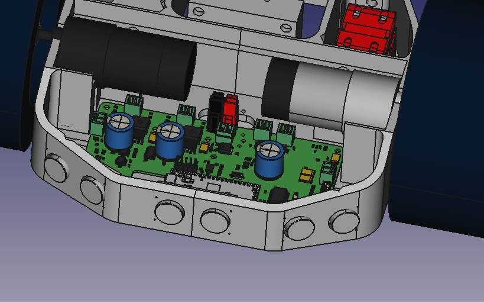
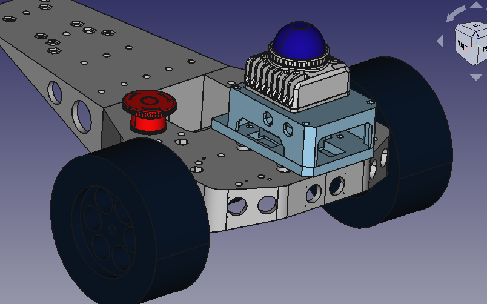
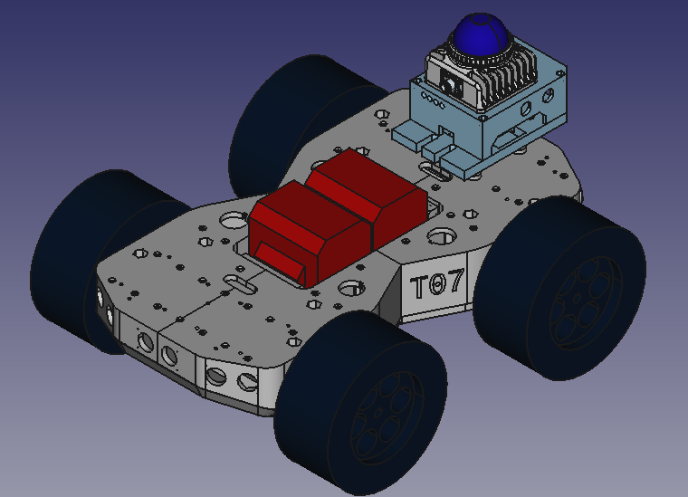

T07
===
Mobile outdoor robotics platform.

### Repositories
* [t07_robot](https://github.com/107-systems/t07_robot): ROS control code for T07 robot.
* [t07_docker](https://github.com/107-systems/t07_docker): Dockerfile and scripts to run T07 control software on [Pika Spark](https://pika-spark.io/).
* [t07_teleop](https://github.com/107-systems/t07_teleop): Keyboard based teleoperation for the T07 mobile outdoor robot.

### 3D-Renderings

   

   

   

   

## Introduction

The T07 mini is an outdoor robotics platform intended for participation in contests like Robotem Rovne, Roboorienteering or Robotour but also for general robotic experiments. There is also a mounting option for the [mandeye-controller](https://github.com/JanuszBedkowski/mandeye_controller).

## special configurations

### T07 4WD

   

## Dimensions

The chassis is 40 cm long and 20 cm wide.

The whole robot with ultrasonic sensors is depending on the wheels about 45 cm long and 35 cm wide. The weight is about 1.5 kg.

### motor shaft and wheel dimension

There are 2 positions to mount the motor shaft.

| motor shaft    | shaft to roller wheel base | roller wheel height     | recommended wheel diameter |
|----------------|----------------------------|-------------------------|----------------------------|
| upper position | 20 mm                      | 100 mm (70 mm diameter) | 160 mm                     |
| lower position | 34 mm                      | 100 mm (70 mm diameter) | 132 mm                     |
| lower position | 34 mm                      | 70 mm (50 mm diameter)  | 72 mm                      |

## Battery

This robot is designed to work with the [Einhell Power X-Change system](https://www.einhell.de/en/battery-system/).

## Assembly

Use flat M6 screw nuts (DIN 439, 3.2 mm high) for the assembly.

## Additional required hardware

### Motors

A motor with a gear ratio of about 1:100 should be ok.

#### standard

  * https://www.reichelt.de/getriebemotor-39-6-mm-75-1-12-v-dc-gm39-6-75-12v-p159644.html
  * https://www.conrad.de/de/p/getriebemotor-12-v-modelcraft-rb350100-0a101r-1-100-227560.html

#### with encoder

  * https://de.sainsmart.com/products/29-1-metal-gearmotor-365rpm-37dx52l-mm-with-64-cpr-encoder-12v
  * https://eu.robotshop.com/de/products/12v-58rpm-60-1-gear-motor-encoder
  * https://eu.robotshop.com/de/products/12v-26rpm-1201-gear-motor-w-encoder

### Wheels

please pay attention to get the right wheel adapter

#### 132 mm

  * https://www.conrad.de/de/p/reely-1-10-monstertruck-komplettraeder-schwarz-2-st-2249111.html

#### 160 mm

  * https://www.conrad.de/de/p/reely-1-6-buggy-komplettraeder-block-spike-8-speichen-schwarz-glaenzend-2-st-2159621.html

#### 70 mm

  * https://eu.robotshop.com/products/70mm-aluminium-wheel-6mm-bore

### Wheel Adapter

  * https://www.pololu.com/product/2687
  * https://eckstein-shop.de/Pololu-12mm-Hex-Wheel-Adapter-for-6mm-Shaft-Extended-2-Pack

### Roller wheel

#### 100 mm height (70 mm diameter)

  * https://www.pollin.de/p/laufrolle-441614
  * https://radundrolle.de/seiten/Lenkrollen/Vollgummi-Lenkrolle_080.htm

#### 70 mm height (50 mm diameter)

  * https://www.pollin.de/p/masterproof-lenkrolle-kugelgelagert-4054-pvc-oe-50-mm-490596

### On/off Switch

  * https://www.reichelt.de/wippenschalter-rund-ip65-1x-ein-aus-sw-sw-ws-r13-112-a-sw-p105455.html

### Emergency Switch

  * https://www.reichelt.de/not-aus-schalter-yw-40-mm-2-nc-id-yw1bv4e02r-p234555.html
  * https://www.conrad.de/de/p/idec-yw1b-v4e01r-not-aus-schalter-240-v-ac-6-a-1-oeffner-1-st-700792.html
  * https://www.conrad.de/de/p/deca-a20b-v4e11r-not-aus-schalter-mit-kontaktelement-240-v-ac-6-a-1-schliesser-1-oeffner-ip65-1-st-1233793.html

## electronics and software

There are mounting holes for a Raspberry Pi or a [Pika Spark](https://docs.pika-spark.io/) on the controller standoff.

[CyphalRobotController07/CAN](https://github.com/generationmake/CyphalRobotController07-CAN) is the main controller board.

## License

This hardware is licensed under the Creative Commons licence CC-BY-SA 4.0
