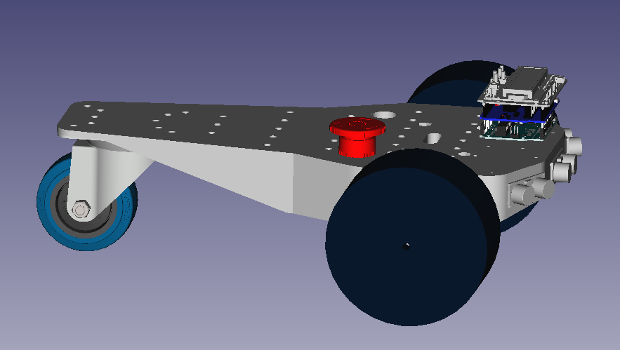

# JECCbot_mini
Outdoor robotics platform

## Introduction

The JECCbot mini is an outdoor robotics platform intended for participation in contests like Robotem Rovne, Roboorienteering or Robotour but also for general robotic experiments. It has mounting positions for Arduino Uno and Mega boards.

## Additional required hardware

### Motors

  * https://www.reichelt.de/getriebemotor-39-6-mm-75-1-12-v-dc-gm39-6-75-12v-p159644.html
  * https://www.ebay.de/itm/SainSmart-29-1-Metal-Gearmotor-Getriebemotor-mit-64-CPR-Encoder-12V-365rpm/113749887018
  * https://www.conrad.de/de/p/getriebemotor-12-v-modelcraft-rb350100-0a101r-1-100-227560.html

### Wheels

 * https://www.conrad.de/de/p/reely-1-10-monstertruck-komplettraeder-extreme-5-doppelspeichen-schwarz-2-st-236925.html

### Wheel Adaptor

  * https://www.ebay.de/itm/Wellenkupplung-Hex-Sechskant-Kupplung-Rad-Antrieb-Modellbau-Kupplung-Welle/162666311593

### Roller wheel

  * https://www.pollin.de/p/laufrolle-441614
  * https://radundrolle.de/seiten/Lenkrollen/Vollgummi-Lenkrolle_080.htm

### On/off Switch

  * https://www.reichelt.de/wippenschalter-rund-ip65-1x-ein-aus-sw-sw-ws-r13-112-a-sw-p105455.html

### Emergency Switch

  * https://www.reichelt.de/not-aus-schalter-yw-40-mm-2-nc-id-yw1bv4e02r-p234555.html

## electronics and software

This platform may be equipped with the hardware and software of the [Arduino on JECCbot mini project](https://github.com/generationmake/Arduino_on_JECCbot_mini).

## License

This hardware is licensed under the Creative Commons licence CC-BY-SA 4.0
